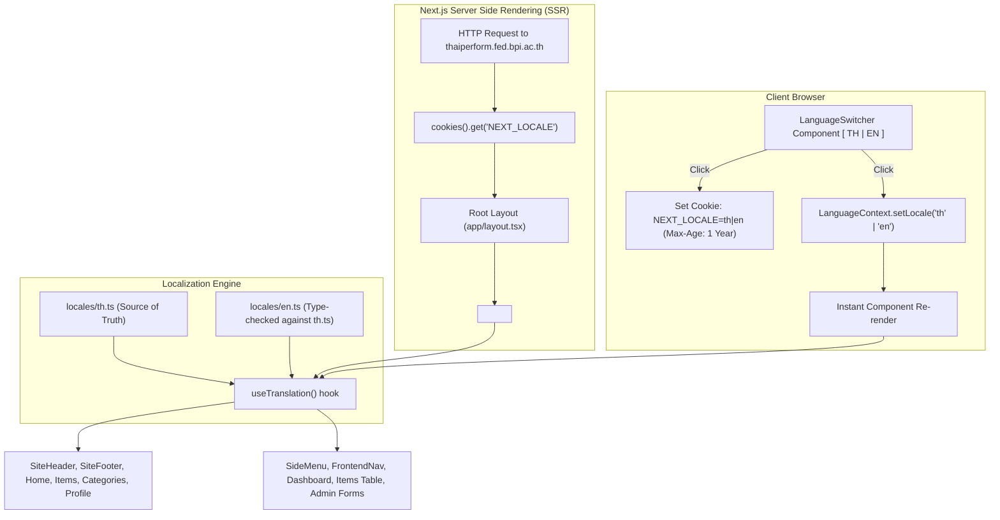

# Design Specification: Bilingual Support (Thai / English) for Frontend & Admin

- **Date**: 2026-09-19
- **Status**: Proposed / Spec Approved
- **Author**: Antigravity & User
- **Target Repository**: `web_rs_thaiarts` (`frontend/`)
- **Production Target**: `https://thaiperform.fed.bpi.ac.th/`

---

## 1. Executive Summary & Goals

### 1.1 Objective
Introduce bilingual language support (Thai and English) across the application, covering both the public member/guest surface (`app/(public)`) and the administrator portal (`app/(admin)`).

### 1.2 Core Invariant: Zero-Regression for Thai Production
The existing Thai deployment at `https://thaiperform.fed.bpi.ac.th/` is functioning well. Under no circumstances should this implementation break existing URL routing, bookmarked paths, API endpoints, or production Docker deployments.

### 1.3 Key Architectural Decisions
1. **In-place State & Cookie Strategy (No URL Path Changes)**:
   - Default URLs remain unchanged (`/`, `/items`, `/about`, `/admin/items`).
   - No subpath routing (`/en/...` or `/[lang]/...`).
   - Language choice is stored in a client-readable HTTP cookie `NEXT_LOCALE` and mirrored in `localStorage`.
2. **Phased Translation Scope**:
   - **Phase 1 (This Spec)**: 100% UI translation across all public pages, headers, footers, admin navigation, tables, forms, modals, status tags, and alert messages.
   - **Phase 2 (Future)**: Database schema migration for bilingual item records (`name_en`, `description_en`) in PostgreSQL.
3. **Cross-Surface Synchronization**:
   - A single cookie `NEXT_LOCALE` synchronizes the language across public pages and admin views seamlessly.
4. **Zero External Dependencies (In-House Localization Engine)**:
   - Type-safe dictionary system with full TypeScript validation (`locales/th.ts`, `locales/en.ts`).
   - Automatic fallback to Thai if an English translation key is missing or blank.
   - SSR Cookie pre-load in `frontend/app/layout.tsx` to eliminate visual hydration flicker.

---

## 2. Architecture & Data Flow



---

## 3. Technical Specifications & File Layout

### 3.1 File Hierarchy
All files are contained within `frontend/`:
```
frontend/
├── locales/
│   ├── index.ts               # Export types, dictionary accessor, fallback resolver
│   ├── th.ts                  # Thai dictionary (Primary/Source of Truth)
│   └── en.ts                  # English dictionary (Strictly typed as Partial<typeof th>)
├── contexts/
│   └── LanguageContext.tsx    # React Context, Provider, useTranslation hook, cookie sync
├── components/
│   ├── LanguageSwitcher.tsx   # Pill toggle button [ TH | EN ]
│   ├── SiteHeader.tsx         # Updated with LanguageSwitcher (Desktop & Mobile drawer)
│   ├── SiteFooter.tsx         # Updated with translated strings
│   ├── FrontendNav.tsx        # Admin topbar updated with LanguageSwitcher
│   ├── SideMenu.tsx           # Admin sidebar menu updated with translated labels
│   └── ConsentBanner.tsx      # Updated with translated cookie notices
└── app/
    └── layout.tsx             # Reads NEXT_LOCALE cookie from next/headers and wraps children
```

### 3.2 Dictionary Design (`frontend/locales/`)
The dictionary will be partitioned into logical namespaces:
- `common`: Global action buttons (`save`, `cancel`, `delete`, `edit`, `back`, `loading`, `confirm`, `search`).
- `nav`: Navigation links (`home`, `catalog`, `categories`, `about`, `profile`, `login`, `signup`, `logout`, `admin`).
- `home`: Hero section headings, call-to-actions, featured sections.
- `items`: Search input placeholder, filter labels (category, duration, performers, occasion), sort options, empty states.
- `itemDetail`: Detail page labels (category, duration, performers count, price, video preview, similar items, reviews).
- `categories`: Category browse page titles and descriptions.
- `about`: About page text and system summary.
- `auth`: Login, registration, password reset form labels, placeholders, and error messages.
- `profile`: User profile tabs, activity history, favorite items, ratings summary.
- `admin`: Admin sidebar items, dashboard statistics titles, items table headers, action buttons, draft creation form, publication banner.
- `footer`: Copyright notice, footer navigation links, contact info.

#### Type Safety Contract:
```typescript
// frontend/locales/th.ts
export const th = {
  common: { ... },
  nav: { ... },
  // ...
};

export type TranslationDictionary = typeof th;

// frontend/locales/en.ts
import type { TranslationDictionary } from "./th";
// Any missing key will fallback to Thai safely at runtime,
// while TypeScript guarantees structural alignment.
export const en: TranslationDictionary = { ... };
```

### 3.3 Server & Client Hydration Contract
In `frontend/app/layout.tsx`:
```typescript
import { cookies } from "next/headers";
import { LanguageProvider } from "@/contexts/LanguageContext";

export default function RootLayout({ children }: { children: React.ReactNode }) {
  const cookieStore = cookies();
  const rawLocale = cookieStore.get("NEXT_LOCALE")?.value;
  const initialLocale = rawLocale === "en" ? "en" : "th";

  return (
    <html lang={initialLocale}>
      <body>
        <LanguageProvider initialLocale={initialLocale}>
          {children}
        </LanguageProvider>
      </body>
    </html>
  );
}
```

### 3.4 Language Switcher UI Component (`frontend/components/LanguageSwitcher.tsx`)
- **Visual Design**: Pill style segmented control:
  - Container: rounded-full border with subtle background.
  - Active segment: primary/gold brand background, bold text.
  - Inactive segment: muted text, hover transition.
- **Accessibility**: ARIA role `group`, `aria-label="Language selection"`, `aria-pressed` on active button.
- **Responsiveness**:
  - Desktop Header: Placed directly next to the user auth chip / login button.
  - Mobile Header: Rendered inside the top bar beside the hamburger menu icon, as well as at the top of the mobile drawer menu.
  - Admin Topbar: Rendered next to the admin user greeting and logout button.

---

## 4. Rollout Strategy & Testing Plan

### 4.1 Implementation Phases
1. **Foundation**:
   - Create `locales/th.ts`, `locales/en.ts`, `locales/index.ts`.
   - Create `contexts/LanguageContext.tsx`.
   - Update `app/layout.tsx` for SSR cookie reading.
2. **Switching UI**:
   - Create `components/LanguageSwitcher.tsx`.
   - Integrate into `SiteHeader.tsx` and `FrontendNav.tsx`.
3. **Public Translation Integration**:
   - Translate `SiteHeader.tsx`, `SiteFooter.tsx`, `ConsentBanner.tsx`.
   - Translate `app/(public)/page.tsx` (Homepage).
   - Translate `app/(public)/items/page.tsx` & `items/[id]/page.tsx`.
   - Translate `app/(public)/categories/page.tsx`, `about/page.tsx`, `profile/page.tsx`.
4. **Admin Translation Integration**:
   - Translate `SideMenu.tsx`.
   - Translate `app/(admin)/dashboard/page.tsx`.
   - Translate `app/(admin)/admin/items/page.tsx` and `components/AdminItemForm*.tsx`.
   - Translate `app/(admin)/admin/analytics/page.tsx`.

### 4.2 Quality Assurance & Verification Commands
- **Type Checking**:
  ```bash
  cd frontend
  npm run type-check
  ```
  *(Must pass with 0 TypeScript errors).*
- **Production Build**:
  ```bash
  cd frontend
  npm run build
  ```
  *(Verifies all static page generation and server components compile cleanly).*
- **Automated Regression Suite**:
  ```bash
  cd frontend
  npm run test:foundation
  npm run test:catalogue
  npm run test:admin
  ```

---

## 5. Non-Goals & Future Work (Phase 2)
- Modifying PostgreSQL database schema for items or categories is deferred to Phase 2.
- Changing URL routing paths to `/en/` is explicitly rejected to eliminate production breakage risks.
- Altering the Python recommender model service (`backend/`) is out of scope (backend processes embeddings independently of UI language).
