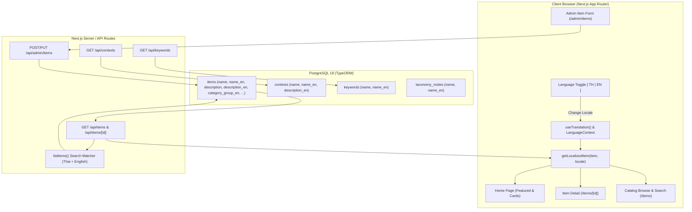

# Design Specification: Bilingual Catalogue & Item Data Support (Phase 2)

- **Date**: 2026-09-19
- **Status**: Spec Approved / Pending Implementation Plan
- **Author**: Antigravity & User
- **Target Repository**: `web_rs_thaiarts` (`frontend/`, `docs/`, `backups/`)
- **Reference Source**: *WIPHITSILPA (วิพิธศิลปา)* reference dataset (`paper/ref/WIPHITSILPA.pdf`)
- **Production Target**: `https://thaiperform.fed.bpi.ac.th/`

---

## 1. Executive Summary & Problem Statement

### 1.1 Problem Statement
In Phase 1, UI chrome, navigation, headers, footers, labels, buttons, and static text were localized into English (`locales/en.ts`) and Thai (`locales/th.ts`).
However, as demonstrated on the homepage and performance detail page (`/items/[id]`):
- Performance titles (e.g. "ผืนไท", "ฟ้อนดวงเดือน", "หนุมานจับนางสุพรรณมัจฉา") remain solely in Thai.
- Performance descriptions, category groups, performance types, occasion tags (`contexts`), cultural keywords (`keywords`), and match suitability badges ("เหมาะสม") remain in Thai even when the language toggle is set to `EN`.

### 1.2 Objective (Phase 2)
Introduce bilingual item records and taxonomic metadata into PostgreSQL and Next.js, allowing the entire catalogue and item journey to be fully experienced in both Thai and English with zero regressions to the existing Thai production environment.

### 1.3 Key Architectural Decisions
1. **Dedicated Column Strategy in Existing Tables (Zero Regression)**:
   - Extend existing tables with nullable `*_en` columns rather than creating polymorphic join tables or changing column types to JSONB.
   - All legacy Thai columns (`name`, `description`, `category_group`, etc.) remain intact and functional without any schema breakage.
2. **Graceful Fallback**:
   - If an item, context, or keyword does not have an English translation (`null` or empty), the system automatically falls back to Thai.
3. **Domain-Accurate Seed Data**:
   - Standard terminology, performance names, and descriptions are cross-referenced with the official reference book *WIPHITSILPA (วิพิธศิลปา)* (`paper/ref/WIPHITSILPA.pdf`) to ensure 100% academic rigor and cultural accuracy.
4. **Hybrid Seeding & Admin Management**:
   - Provide high-quality initial translations for all existing items via TypeORM migration/seed scripts.
   - Extend the Admin Item creation & editing interface to allow admins to manage English translations alongside Thai fields.
5. **Bilingual Search & API Transparency**:
   - API endpoints (`/api/items`, `/api/items/[id]`, `/api/contexts`, `/api/keywords`) return both language values simultaneously.
   - Catalogue search supports queries in both Thai and English seamlessly.

---

## 2. Architecture & Data Flow



---

## 3. Database Schema & Migration Specification

### 3.1 Table Modifications

#### Table `items`:
- `name_en`: `VARCHAR(255) NULL`
- `description_en`: `TEXT NULL`
- `category_group_en`: `VARCHAR(255) NULL`
- `performance_type_en`: `VARCHAR(255) NULL`
- Index: `ix_items_name_en`

#### Table `contexts` (Occasions / Events):
- `name_en`: `VARCHAR(255) NULL`
- `description_en`: `TEXT NULL`

#### Table `keywords`:
- `name_en`: `VARCHAR(255) NULL`

#### Table `taxonomy_nodes`:
- `name_en`: `VARCHAR(255) NULL`

### 3.2 TypeORM Migration Contract
- File: `frontend/db/migrations/1787400000000-AddBilingualCatalogueColumns.ts`
- Performs safe `table.addColumns(...)` in `up()` with fallback checks (`queryRunner.hasColumn(...)`).
- Reversible in `down()` by dropping the specific added columns.

### 3.3 TypeORM Entities (`frontend/db/entities/Catalogue.ts`)
Update entity interfaces and schemas:
```typescript
export interface CatalogueItem {
  id: number;
  artifactItemId: number;
  name: string;
  nameEn?: string | null;
  description: string;
  descriptionEn?: string | null;
  categoryGroup: string;
  categoryGroupEn?: string | null;
  performanceType: string;
  performanceTypeEn?: string | null;
  // ... existing columns
}
```

---

## 4. Initial Translation Seeding Strategy (`WIPHITSILPA.pdf`)

A dedicated migration / seed script (`frontend/db/seeds/catalogue-bilingual.seed.ts`) will populate the English translations:
1. **Reference Extraction**: Extract translations for canonical performances (such as Ramayana/Khon episodes, folk dances like Fon Phaang, Fon Lep, Fon Duang Duean, Phuen Thai, Nora, etc.) directly from *WIPHITSILPA*.
2. **Contexts / Occasions**:
   - `วันขึ้นปีใหม่` -> `New Year's Day`
   - `วันสงกรานต์` -> `Songkran Festival (Thai New Year)`
   - `วันลอยกระทง` -> `Loy Krathong Festival`
   - `วันตรุษจีน` -> `Chinese New Year`
   - `การเผยแพร่วัฒนธรรมต่างประเทศ` -> `International Cultural Exchange`
   - `การเผยแพร่วัฒนธรรมในประเทศ` -> `Domestic Cultural Exhibition`
   - `งานมงคลสมรส` -> `Wedding Celebration`
   - `งานต้อนรับอาคันตุกะ` -> `Reception of Foreign Guests & Dignitaries`
3. **Categories & Types**:
   - `การแสดงนาฏศิลป์สร้างสรรค์` -> `Creative Thai Dance & Performance`
   - `การแสดงสร้างสรรค์` -> `Creative Performance`
   - `ระบำ` -> `Standard Rabam Dance`
   - `รำ` -> `Classical Ram Dance`
   - `ฟ้อน` -> `Northern & Northeastern Folk Dance (Fon)`
   - `โขน` -> `Khon Masked Dance Drama`
   - `ละคร` -> `Lakhon Dance Drama`
4. **Keywords**:
   - Core musical instruments, attributes, and staging terms mapped to appropriate English cultural terms.

---

## 5. API & Server Changes

### 5.1 Type Definitions (`frontend/lib/types/catalog.ts`)
```typescript
export interface ItemOut {
  id: number;
  name: string;
  name_en?: string | null;
  description: string;
  description_en?: string | null;
  category_group: string;
  category_group_en?: string | null;
  performance_type: string;
  performance_type_en?: string | null;
  performers_count: number | null;
  duration_minutes: number | null;
  price_text: string;
  image_url: string;
  video_url: string;
  keywords: KeywordOut[];
  contexts: ContextOut[];
  user_state: UserState;
  match_percent: number | null;
  suitability_label: string | null;
  suitability_label_en?: string | null;
}

export interface ContextOut {
  id: number;
  name: string;
  name_en?: string | null;
  group: string;
  description: string;
  description_en?: string | null;
  active_item_count: number;
}

export interface KeywordOut {
  id: number;
  name: string;
  name_en?: string | null;
  taxonomy_path: string;
}
```

### 5.2 Server Catalogue Resolver (`frontend/lib/server/catalogue.ts`)
1. **`catalogueItemOut`**:
   - Maps `name_en`, `description_en`, `category_group_en`, and `performance_type_en`.
   - Computes `suitability_label_en`:
     - `>= 92%` -> `"Highly Recommended"`
     - `>= 87%` -> `"Recommended"`
     - `< 87%` -> `"Suitable"`
2. **Search Matcher**:
   - Update `listItems` search logic to check both Thai and English fields:
     `item.name.toLowerCase().includes(term) || (item.nameEn && item.nameEn.toLowerCase().includes(term))`
     `item.categoryGroup.toLowerCase().includes(term) || (item.categoryGroupEn && item.categoryGroupEn.toLowerCase().includes(term))`
     `item.description.toLowerCase().includes(term) || (item.descriptionEn && item.descriptionEn.toLowerCase().includes(term))`

---

## 6. Frontend Presentation & Localization Helper

### 6.1 Central Localization Helper (`frontend/lib/localization.ts`)
```typescript
export function getLocalizedItem(item: ItemOut, locale: "th" | "en") {
  const isEn = locale === "en";
  return {
    ...item,
    displayName: isEn && item.name_en ? item.name_en : item.name,
    displayDescription: isEn && item.description_en ? item.description_en : item.description,
    displayCategoryGroup: isEn && item.category_group_en ? item.category_group_en : item.category_group,
    displayPerformanceType: isEn && item.performance_type_en ? item.performance_type_en : item.performance_type,
    displaySuitability: isEn ? (item.suitability_label_en ?? "Recommended") : (item.suitability_label ?? "เหมาะสม"),
  };
}

export function getLocalizedContext(context: ContextOut, locale: "th" | "en") {
  return {
    ...context,
    displayName: locale === "en" && context.name_en ? context.name_en : context.name,
    displayDescription: locale === "en" && context.description_en ? context.description_en : context.description,
  };
}

export function getLocalizedKeyword(keyword: KeywordOut, locale: "th" | "en") {
  return {
    ...keyword,
    displayName: locale === "en" && keyword.name_en ? keyword.name_en : keyword.name,
  };
}
```

### 6.2 Components Updated
- `frontend/components/CatalogItemCard.tsx`: Uses localized name, description, categories, and occasion tags.
- `frontend/app/(public)/items/[id]/page.tsx`: Uses localized hero title, description, badge, occasion links, cultural keywords, and sidebar stats.
- `frontend/app/(public)/page.tsx`: Uses localized featured cards.
- `frontend/app/(public)/categories/page.tsx`: Uses localized category names and occasion tags.

---

## 7. Admin Management Portal

### 7.1 Admin Form (`frontend/components/AdminItemFormDraftStep.tsx` & `AdminItemFormHelpers.ts`)
- Add fields to `DraftFields`:
  - `name_en: string`
  - `description_en: string`
  - `category_group_en: string`
  - `performance_type_en: string`
- In the UI form:
  - Provide structured bilingual input sections (e.g. Thai section and English section).
  - English fields are marked optional with helpful placeholder text.
- Save and commit actions properly pass `*_en` attributes through to the persistence layer.

---

## 8. Verification & Testing Plan

1. **Schema & Migration Integrity**:
   - `npm run migration:run` executes cleanly on PostgreSQL 18.
   - `npm run migration:verify` passes.
2. **Seed & Translation Validation**:
   - Running the seed populates non-empty `name_en` and `description_en` for existing catalogue items.
3. **Type Checking & Build**:
   - `npm run type-check` completes with 0 errors.
   - `npm run build` completes cleanly without SSR or hydration errors.
4. **Automated Test Suite**:
   - `npm run test:catalogue`
   - `npm run test:foundation`
   - `npm run test:admin`
5. **Visual Verification**:
   - Navigating to `/` and toggling `[ EN ]` switches card titles and descriptions to English.
   - Navigating to `/items/262139617` and toggling `[ EN ]` switches title, category line, suitability badge ("Recommended · 87%"), description, occasion tags, and keyword tags to English.
   - Switching back to `[ TH ]` restores 100% original Thai text.
